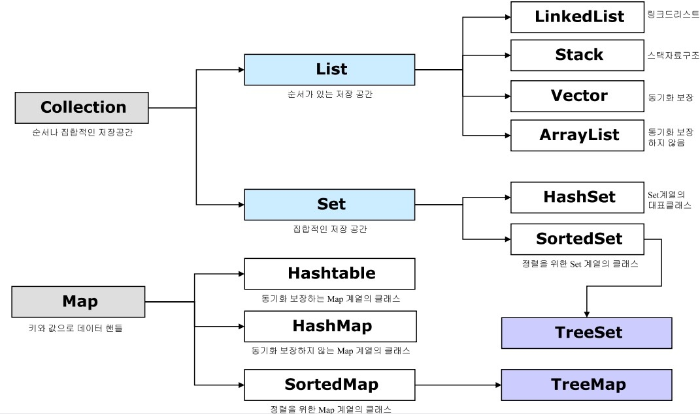

# Ch4. 어디에 담아야 하는지

- 자바에서는 데이터를 담아둘 때, collection framework(List, Map 등) 와 배열을 많이 이용한다.

# Collection 및 Map 인터페이스의 이해

- 다른 이미지
    
    
    
- 배열을 제외하면 데이터를 가장 담기 좋은 객체는 Collection과 Map 인터페이스를 상속한 객체

# Collection

## 종류

`Collection`: 가장 상위 인터페이스

`Set`: 중복을 허용하지 않는 집합을 처리하기 위한 인터페이스

`SortedSet`: 오름차순을 갖는 Set 인터페이스

`List`: 순서가 있는 집합을 처리하기 위한 인터페이스이기 때문에 인덱스가 있어 위치를 지정하여 값을 찾을 수 있다.

`Queue`: 여러 개의 객체를 처리하기 전에 담아서 처리할 때 사용하기 위한 인터페이스이다. 기본적으로 FIFO(선입선출)를 따른다.

`Map`: 키와 값의 쌍으로 구성된 객체의 집합을 처리하기 위한 인터페이스. 중복되는 키를 허용하지 않는다.

`SortedMap`: 키를 오름차순으로 정렬하는 Map 인터페이스

## Set 인터페이스

- **중복을 허용하지 않는다.**
- 중복이 없는 집합 객체를 만들 때 유용하다
    - 전체 임직원의 이름 개수를 확인할 때 → 중복 이름 제거해야하므로 set객체 이용
    

### Set 인터페이스 구현 클래스

- `HashSet`: 해쉬테이블에 순서에 상관없이 데이터를 저장
- `TreeSet:` : **red-black**이라는 트리에 데이터를 담음 / 이진 트리 구조로 데이터를 담는 구조
    - 규칙
        
        
        
        1. 각각의 노드는 검은색이나 붉은색이어야 함
        2. 가장 상위(root) 노드는 검은색
        3. 가장 말단(leaves)노드는 검은색
        4. 붉은 노드는 검은 하위 노드만을 가짐
        5. 모든 말단 노드로 이동하는 경로의 검은 노드 수는 동일
    - 값에 따라서 순서가 정해짐
    - 데이터를 담으면서 동시에 정렬하기 때문에 HashSet보다 성능상 느림
- `LinkedHashSet :`해쉬 테이블에 데이터를 담음 /  저장된 순서에 따라서 순서가 결정됨

## List 인터페이스

- 배열의 확장판이라고 보면 됨
- 담을 수 있는 크기가 자동으로 증가되므로, 데이터의 개수를 확실히 모를 때 유용하게 사용
- 중복 허용 / Index를 이용해 데이터를 검색 및 추가, 삭제 가능

### List 인터페이스 구현 클래스

- `Vector`: 객체 생성 시에 크기를 지정할 필요가 없는 배열 클래스
    - 동기화 처리 되어있어서 여러 스레드에서 접근 안됨
- `ArrayList` : Vector와 비슷하지만, 동기화 처리가 되어 있지 않음
    - 순차접근/임의접근 가능
- `LinkedList`: ArrayList와 동일하지만, Queue 인터페이스를 구현했기 때문에 FIFO 큐 작업을 수행한다.

# Map

- Map은 Key와 Value 쌍으로 저장되는 구조체
- 단일 객체만 저장되는 다른 Collection API들과는 다르게 따로 구분
    - ID-Password 등 고유한 값과 그 값을 설명하는 데이터 보관시 유용

## 종류

- `HashTable`: 데이터를 해쉬 테이블에 담는 클래스
    - 내부에서 관리하는 해쉬 테이블 객체가 동기화되어 있다.
- `HashMap`: 데이터를 해쉬 테이블에 담는 클래스
    - HashTable 클래스와는 다르게 null 값을 허용한다는 것과 동기화되어 있지 않다.
- `TreeMap`: red-black 트리에 데이터를 담는다
    - TreeSet과는 다르게 키에 의해 순서가 정해진다.
- `LinkedHashMap`: HashMap과 거의 동일하며 **이중 연결 리스트**(Doubly-LinkedList)라는 방식을 사용하여 데이터를 담는다는 점만 다르다.
    - 이중연결리스트: 앞뒤 노드에 대한 링크 정보를 갖고 있는 것을 말함

# Queue

- 데이터를 담아두었다가 먼저 들어온 데이터부터 처리하기 위해 이용됨
    - SMS와 같은 문자를 처리할 때 서버에 드렁오는 순서대로 처리하려면 Queue에 던져주고 처음에 요청한 데이터부터 처리하면 됨

## Queue가 필요한 이유

> List도 순서가 있고, Queue도 순서가 있는데 왜 필요?
> 
- List의 가장 큰 단점
    - **데이터가 많은 경우 처리 시간이 늘어난다**
    - 가장 앞에 있는 데이터를 지우고 그 다음 1번 데이터부터 마지막 데이터까지 한 칸씩 옮기는 작업을 수행해야 하므로, 데이터가 적을 때는 상관없지만, 데이터가 많으면 많을수록 가장 앞에 있는 데이터를 지우는데 소요되는 시간이 증가한다.

## Queue 인터페이스 구현 클래스

- java.util 패키지에 속하는 LinkedList와 PriorityQueue( 일반적인 목적의 큐 클래스)
- java.util.concurrent 패키지에 속하는 클래스들(ConcurrentQueue 클래스)

`PriorityQueue`: 큐에 추가된 순서와 상관없이 먼저 생성된 객체가 먼저 나오도록 되어 있는 Queue

`LinkedBlockingQueue`: 저장할 데이터의 크기를 선택적으로 정할 수도 있는 FIFO 기반의 링크 노드를 사용하는 블로킹 Queue

`ArrayBlockingQueue`: 저장되는 데이터의 크기가 정해져 있는 FIFO 기반의 블로킹 Queue

`PriorityBlockingQueue`: 저장되는 데이터의 크기가 정해져 있지 않고, 객체의 생성순서에 따라서 순서가 저장되는 블로킹 Queue

`DelayQueue`: 큐가 대기하는 시간을 지정하여 처리하도록 되어 있는 Queue

`SynchronousQueue`: put() 메서드를 호출하면, 다른 스레드에서 take() 메서드가 호출될 때까지 대기하도록 되어 있는 Queue. 이 큐에는 저장되는 데이터가 없다. API에서 제공하는 대부분의 메서드는 0이나 null을 리턴한다.

- Blocking Queue란 크기가 지정되어 있는 큐에 더 이상 공간이 없을 때, 공간이 생길 때까지 대기하도록 만들어진 큐를 의미한다.

# Set 클래스 중 무엇이 가장 빠를까?

- **저장성능 : HashSet > LinkedHashSet > TreeSet**
    - HashSet에 데이터를 담을 시, 크기를 미리 지정해주면 큰 차이는 나지 않지만 성능 향상
- **읽기성능 : LinkedHashSet > HashSet > TreeSet (for문으로 반복)**
    - TreeSet이 느린 이유는 정렬 프로세스가 있어서 그렇다(NavigableSet). 만약, 데이터를 순서에 따라 탐색하는 작업이 필요하면 TreeSet을 사용하면 좋다.

# List 관련 클래스 중 무엇이 빠를까?

- **저장성능(add()) : ArrayList > Vector > LinkedList (크게 차이는 안남)**
- **읽기성능(get()) : ArrayList > Vector > LinkedList (ArrayList가 압도적으로 빠름)**
    - LinkedList 읽기성능이 느린 이유는 LinkedList는 Queue 인터페이스를 상속받기 때문에, get()보다는 순차적으로 결과를 받아오는 peek()이나 poll() 메서드를 사용해야 한다.
- Vector는 여러 스레드에서 접근할 경우를 방지하기 위해 get() 메서드에 synchronized가 선언되어 있어서 성능 저하가 발생할 수 밖에 없다.

# Map 관련 클래스 중 무엇이 빠를까?

- 저장성능 : 성능자체는 다 비슷.
- 읽기성능 : HashMap > LinkedHashMap > HashTable > **TreeMap**
    - 대부분의 클래스들이 동일하지만, 트리 형태로 처리하는 TreeMap 클래스가 가장 느리다.

→ 필요한 용도에 가장 적합한 클래스를 선택하여 사용하는게 중요

→ 각 인터페이스별 가장 일반적으로 사용되는 클래스

| 인터페이스 | 클래스 |
| --- | --- |
| Set | HashSet |
| List | ArrayList |
| Map | hashMap |
| Queue | LinkedList |

# Collection 관련 클래스의 동기화

## **동기화(synchronized)되지 않은 클래스**

- `HashSet`, `TreeSet`, `LinkedHashSet`, `ArrayList`, `LinkedList`, `HashMap`, `TreeMap`, `LinkedHashMap`

## 동기화되어 있는 클래스

- `Vector`와 `HashTable`

### 📍Collections 클래스

- **최신 버전 클래스들의 동기화를 지원하기 위한 synchronized로 시작하는 메서드가 있다**

### 📍**Map**

- 키 값들을 Set으로 가져와 Iterator를 통해 데이터를 처리하는 경우가 발생→이때ConcurrentModificationException이라는 예외가 발생
- 이 예외가 발생하는 여러 가지 원인 중 하나는 스레드에서 Iterator로 어떤 Map 객체의 데이터를 꺼내고 있는데, 다른 스레드에서 해당 Map을 수정하는 경우다.
- java.util.concurrent 패키지에 있는 클래스들 확인해보면 됨